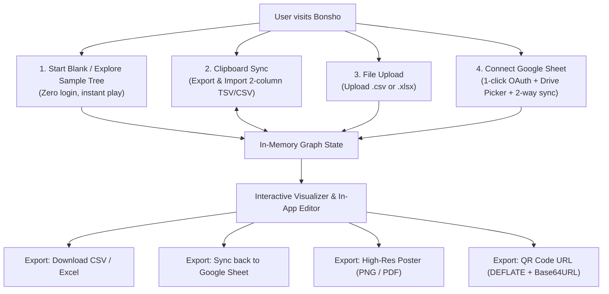

# Bonsho (বংশ) - System Architecture & Design Document

> **Bonsho (বংশ)** is a privacy-first, zero-data-retention family tree visualizer designed specifically for Bangladeshi genealogical traditions, powered by simple 2-column Google Sheets, CSV/Excel files, or direct clipboard copy-paste.

---

## 1. Core Principles & Philosophy

1. **Zero Data Retention**:
   - Bonsho has **no database** and **no backend server**.
   - All data parsing, graph generation, and tree visualization happen **100% in-memory within the user's browser session**.
   - When the user closes the tab, all in-memory data disappears unless the user saved it back to their Google Sheet or downloaded it as a file.

2. **100% Static Frontend (GitHub Pages / `github.io`)**:
   - Hosted statically on GitHub Pages at zero cost.
   - Completely open-source and auditable: users can verify in their browser's Network Inspector that no personal family data or PII is sent to any third-party server.

3. **Zero Developer/User GCP Friction**:
   - End-users **never** configure Google Cloud Platform (GCP).
   - Users can start immediately without any login or account.
   - For cloud sync, the app uses standard Google Identity Services (GIS) OAuth 2.0 with the restrictive `drive.file` and `spreadsheets` scopes.
   - **Graceful Degradation**: If `VITE_GOOGLE_CLIENT_ID` is not configured at build time (e.g. via GitHub Repository Variables), the "গুগল শিট" sync button is gracefully disabled with an explanatory hover tooltip directing users to the friction-free Paste and File Upload modes. No browser prompts or credential dialogs are ever shown to end users.

4. **Native Browser Navigation & Deep Linking**:
   - All interactive states (viewing a person, editing details, adding relatives, opening clipboard or Google sync, and search queries) sync bidirectionally with browser history via HTML5 `pushState` and `popstate`.
   - The browser's Back and Forward buttons work seamlessly across all modal and relative inspection levels without trapping the user or accidentally leaving the site.
   - Deep linking is supported: bookmarking or sharing a URL with `?person=Name` opens that exact person's profile drawer instantly.

5. **Robust Canvas Pointer Isolation & Dynamic Auto-Centering**:
   - The visualizer strictly isolates canvas drag/pan gestures from click events using distance thresholds (`Math.hypot(dx, dy) < 5px`) and pointer-up tracking.
   - Floating controls (zoom buttons, reset view, mini-map, and context action prompts) explicitly isolate event propagation (`stopPropagation`), preventing ghost canvas clicks or unwanted form triggers on double clicks.
   - Dynamic viewport bounding-box calculations compute the global envelope of all nodes and marriages, automatically centering and scaling trees of any dimension on initial load and view reset.

---

## 2. Supported Input & Onboarding Modes

Users can start visualizing their lineage in 4 friction-free ways:



1. **Clipboard Sync (Export & Import)**:
   - Users can open the clipboard modal to see their tree represented as a live-syncing 2-column CSV text block.
   - 1-click **Copy** exports the tree data to the clipboard.
   - Users can edit the text or paste new data from Google Sheets/Excel directly into the modal and click **Apply** to instantly update the visualizer.
2. **Start Blank / Empty Canvas & Multi-Root Support**:
   - Creating a new tree starts with a completely empty canvas (no dummy placeholder person).
   - If the canvas is empty, clicking anywhere opens the form to add the first person.
   - If the canvas has people, clicking in any empty space spawns a floating **Add Person** button to easily add new, unconnected roots to the forest.
   - Bonsho supports **multiple independent roots** rendered side-by-side without spouse duplication.
3. **Progressive Disclosure Data Entry**:
   - Relative addition and editing modals default to only **Name** and **Gender**, keeping data collection friction-free.
   - Optional attributes (**Birthday/Year**, **Address/Village**, **Death year**, and **Info/Notes**) are added on-demand via clickable button pills.
4. **File Upload**:
   - Drag & drop any `.csv` or `.xlsx` file.
5. **Connect Google Sheet**:
   - 1-click spreadsheet creation directly in Google Drive, or connect an existing sheet via Google Drive Picker or URL.
   - Handles multi-account URLs (`/u/0/d/...`) and empty spreadsheets gracefully.
   - Supports two-way synchronization: in-app edits can be saved directly back to the Google Sheet.
6. **QR Code URL Export & Direct Scan**:
   - Compresses the entire tree 100% client-side using `pako` (`deflateRaw` level 9) and converts it to a compact, URL-safe Base64URL string (`-`, `_`, no padding).
   - Preserves complete Unicode integrity for 3-byte Bengali text and complex multi-spouse genealogical trees via standard `TextEncoder` / `TextDecoder`.
   - Encodes a self-contained, **0-redirect hash URL**: `<domain>/#/view/qr-v0/<compressed-data>` that works seamlessly across GitHub Pages without server-side routing or 404 delays.
   - Includes a fallback SPA router (`public/404.html`) that gracefully intercepts legacy or direct pathname visits (`/view/qr-v0/...`) and translates them into the client hash route.
   - Scanning or navigating to the link decompresses the tree data synchronously on page load and immediately renders the interactive visualizer.
   - Users can download the crisp QR code image (PNG rendered with error-correction `L` and 8x scaling), copy the full link, or take a screenshot to share with relatives.

---

## 3. The 2-Column Key-Value Block Format

The spreadsheet format consists of a single tab with **two columns**: `Column A (Property / Key)` and `Column B (Value)`. Each person is defined as a contiguous block of rows. A new person block automatically starts whenever a `Name` (or its synonym) is encountered.

### A. Patrilineal Example (Multi-Spouse & Child Association)
Listing `Child` directly beneath a `Wife` row associates the child with that specific marriage:
```text
Key             | Value
----------------+-------------------------
Name            | আক্কাস আলী
Id              | akkas-1                  (Optional, defaults to Name)
Gender          | Male
Date of birth   | 1935
Date of death   | 2012                     (Automatically adds মরহুম badge)
Village         | রামপুর, চাঁদপুর
Photo           | https://example.com/photo.jpg
Notes           | বীর মুক্তিযোদ্ধা
Wife            | সালেহা বেগম              (1st Wife)
Child           | মতিউর রহমান              (Child of 1st Wife)
Child           | রোকসানা আক্তার           (Child of 1st Wife)
Wife            | খাদিজা খাতুন             (2nd Wife)
Child           | সাজিদুর রহমান            (Child of 2nd Wife)
```

### B. Matrilineal / Mother-Centric Example (মাতৃতান্ত্রিক বা মাতুল বংশ)
Works identically when the mother is the anchor (e.g. Garo / Khasi matrilineal traditions or maternal trees):
```text
Key             | Value
----------------+-------------------------
Name            | মেবেল মারাক
Gender          | Female
Clan / মাহারি   | মারাক (Marak)
Village         | বিরিশিরি, নেত্রকোণা
Husband         | জন নকরেক                 (1st Husband)
Child           | সিলভিয়া মারাক
Child           | প্রবীর মারাক
Husband         | লরেন্স সাংমা             (2nd Husband)
Child           | রিমা মারাক
```

### C. Connecting Generations
When a child (`মতিউর রহমান`) is introduced under a parent, their branch can be expanded anywhere else in the sheet:
```text
Key             | Value
----------------+-------------------------
Name            | মতিউর রহমান
Gender          | Male
Date of birth   | 1965
Profession      | অধ্যাপক (Professor)
Wife            | নাজনীন আক্তার
Child           | নাদিম রহমান
Child           | তাসনিম রহমান
```

---

## 4. Bilingual Polyglot Key-Value Dictionary

The parser normalizes keys (ignoring case, trimming whitespace, and translating synonyms between Bangla and English):

| Standard Key | English Synonyms | Accepted বাংলা প্রতিশব্দ |
| :--- | :--- | :--- |
| `name` | `Name`, `Full Name`, `Person` | `নাম`, `পুরো নাম`, `ব্যক্তি` |
| `id` | `Id`, `ID`, `Identifier` | `আইডি`, `নম্বর` |
| `gender` | `Gender`, `Sex` | `লিঙ্গ`, `জেন্ডার`, `পুরুষ/নারী` |
| `birth` | `Date of birth`, `DOB`, `Birth`, `Birth Year` | `জন্ম`, `জন্মতারিখ`, `জন্ম সাল`, `জন্ম সন` |
| `death` | `Date of death`, `DOD`, `Death`, `Passed Away` | `মৃত্যু`, `ইন্তেকাল`, `মৃত্যু সাল`, `ওফাত` |
| `spouse_female` | `Wife` | `স্ত্রী`, `বউ`, `সহধর্মিণী` |
| `spouse_male` | `Husband` | `স্বামী`, `পতি` |
| `spouse_any` | `Spouse`, `Partner` | `দম্পতি`, `জীবনসঙ্গী` |
| `child` | `Child`, `Son`, `Daughter`, `Children` | `সন্তান`, `ছেলে`, `মেয়ে`, `পুত্র`, `কন্যা` |
| `father` | `Father`, `Dad` | `পিতা`, `বাবা`, `আব্বা`, `আব্বু` |
| `mother` | `Mother`, `Mom` | `মাতা`, `মা`, `আম্মা`, `আম্মু` |
| `photo` | `Photo`, `Image`, `Picture` | `ছবি`, `ফটোগ্রাফ` |
| `village` | `Village`, `Address`, `Origin`, `Ancestral Home` | `গ্রাম`, `গ্রামের বাড়ি`, `ঠিকানা`, `আদি বাড়ি`, `দেশ` |
| `notes` | `Notes`, `Info`, `Bio`, `Description`, `Title` | `মন্তব্য`, `তথ্য`, `বিবরণ`, `স্মৃতি`, `খেতাব`, `উপাধি` |
| `*` (Arbitrary) | Any custom key (e.g. `Blood Group`) | যেকোনো বাংলা প্রপার্টি (যেমন `পেশা`, `রক্তের গ্রুপ`) |

---

## 5. Technology Stack

- **Application Framework**: Vite + React 18+ + TypeScript
  - Modular Custom Hooks (`useFamilyTree`, `useGoogleSync`, `useAppNavigation`, `useToast`) for state management, separation of concerns, and in-app notifications
- **Styling & Interaction**: Tailwind CSS + Lucide Icons
  - 100% Non-blocking, modern UI: Contextual in-app toasts (`Toast.tsx`), inline delete confirmations, and graceful disabled states (zero native browser `alert()` or `confirm()`)
- **Bangla Typography**: Google Fonts (`Hind Siliguri` / `Noto Sans Bengali`)
- **Data Parsing, Serialization & Compression**:
  - Custom Key-Value Block Parser (`src/lib/parser.ts`)
  - `papaparse` for CSV & TSV parsing
  - `xlsx` for Excel import/export
  - `pako` for cross-browser, synchronous raw DEFLATE compression & decompression
  - `qrcode` for high-resolution client-side QR code canvas generation with embedded Bangladesh coin logo
- **Visualization Engine & Export**:
  - SVG + custom hierarchical DAG layout tailored for multi-spouse family trees
  - Dual-mode PNG image export via `html-to-image`:
    1. **Full Tree Export**: Live DOM boundary calculation and auto-alignment at 100% scale with embedded branded QR code
    2. **Viewport Export**: Instant snapshot of current zoom/pan with stamped QR code
  - Interactive pan, pinch-to-zoom (cursor/pinch-centered), search, branch highlighting, and person detail drawer
- **Google Cloud Services (Optional Cloud Sync)**:
  - Google Identity Services (GIS) Token Client (via `VITE_GOOGLE_CLIENT_ID` injected at build-time)
  - Google Sheets API v4 (Client-side REST via user's ephemeral token)
  - (Optional) Google Drive Picker API v1 (via `VITE_GOOGLE_API_KEY`)
- **Deployment & Routing**:
  - GitHub Pages (`https://bonsho-bd.github.io`) via GitHub Actions
  - Client-side 0-redirect hash router (`/#/view/qr-v0/<data>`)
  - `public/404.html` SPA redirect fallback for direct subpath requests

---

## 6. Repository Structure

```
bonsho/
├── .github/
│   └── workflows/
│       └── deploy.yml          # GitHub Pages automated build & deploy
├── docs/
│   └── ARCHITECTURE.md         # This design document
├── public/
│   ├── 404.html                # GitHub Pages SPA router fallback (redirects to hash routes)
│   └── tree-icon.svg           # Site favicon & custom coin logo
├── src/
│   ├── components/
│   │   ├── AddRelativeModal.tsx# Quick relative addition modal
│   │   ├── EditPersonModal.tsx # Full profile editor modal with inline delete confirmation
│   │   ├── GoogleSyncModal.tsx # Google Drive picker and sync controls
│   │   ├── Header.tsx          # Top bar with search, sync, and share/export menus
│   │   ├── PasteModal.tsx      # Clipboard Sync modal (with inline error feedback)
│   │   ├── PersonModal.tsx     # Detail drawer and editor (+ Add Child, + Add Spouse)
│   │   ├── QRCodeModal.tsx     # QR code display with centered logo, link copy, & PNG download
│   │   ├── Toast.tsx           # Non-blocking floating toast notification container
│   │   └── Visualizer.tsx      # SVG canvas with pan, pinch-zoom, and auto-centering
│   ├── lib/
│   │   ├── dictionary.ts       # Bilingual key-value normalizer
│   │   ├── googleAuth.ts       # GIS and Drive Picker client wrapper
│   │   ├── kinship.ts          # Bangladeshi kinship calculator (চাচা, মামা, খালা, etc.)
│   │   ├── parser.ts           # 2-column block parser (CSV/TSV/Sheet -> Graph)
│   │   ├── qrCodec.ts          # Pako DEFLATE + Base64URL codec, URL parser, & QR logo generator
│   │   ├── sampleData.ts       # Bengali demo family tree dataset
│   │   └── serializer.ts       # Graph -> 2-column block format (for saving/exporting)
│   ├── hooks/
│   │   ├── useAppNavigation.ts # Custom router, history, and modal orchestrator
│   │   ├── useFamilyTree.ts    # Tree mutation logic, add/edit/delete, localStorage
│   │   ├── useGoogleSync.ts    # Google Sheets connection, quick sync, unload warnings
│   │   └── useToast.ts         # Ephemeral toast notification state management
│   ├── types/
│   │   └── family.ts           # TypeScript interfaces for Person, Marriage, Graph
│   ├── App.tsx
│   ├── index.css
│   └── main.tsx
├── .env.example
├── package.json
├── tailwind.config.js
├── vite.config.ts
└── README.md
```

